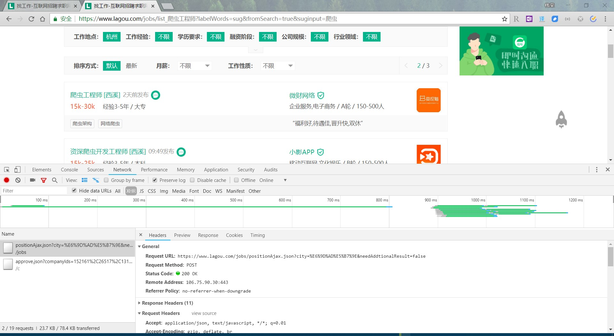
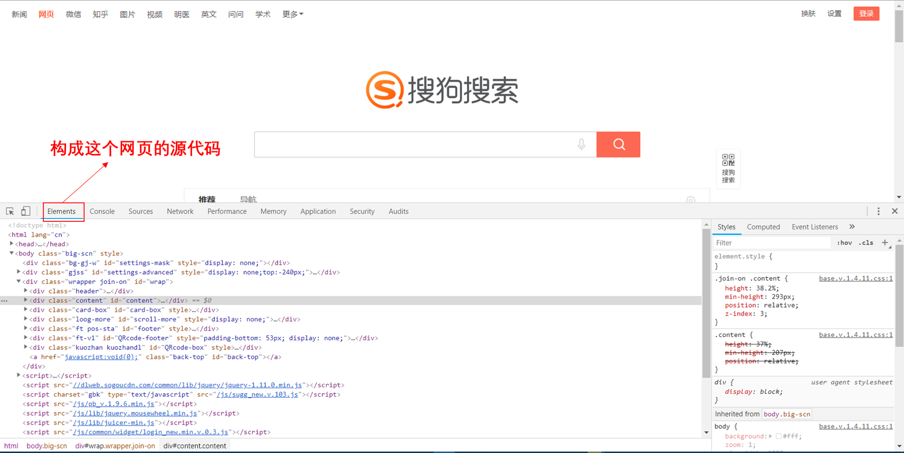
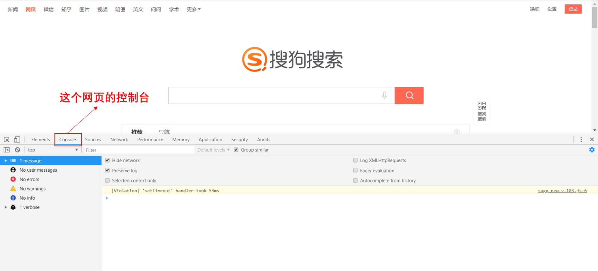
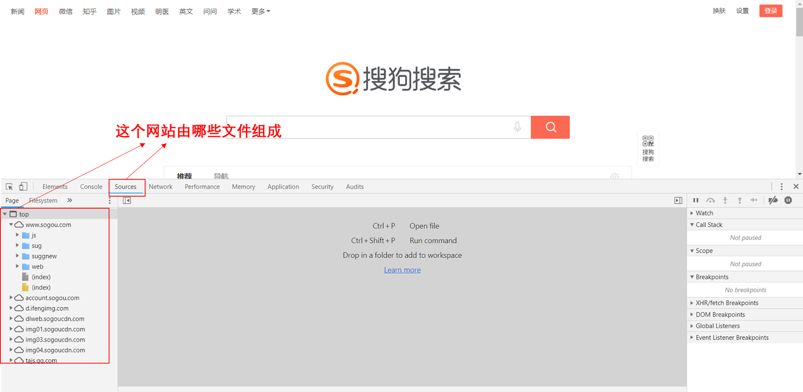
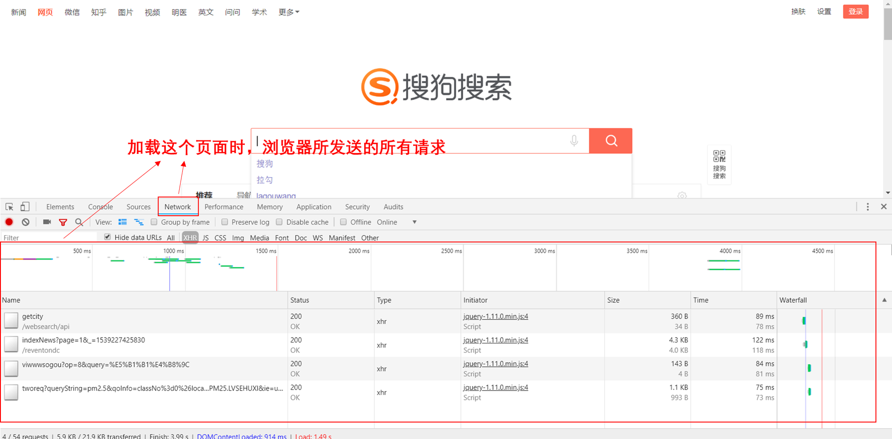

### 爬虫的定义

网络爬虫（又被称为网页蜘蛛，网络机器人，在FOAF社区中间，更经常的称为网页追逐者），是一种按照一定的规则，自动地抓取万维网信息的程序或者脚本。

### 爬虫的作用

- 市场分析：电商分析、商圈分析、一二级市场分析等
- 市场监控：电商、新闻、房源监控等
- 商机发现：招投标情报发现、客户资料发掘、企业客户发现等

------

### 了解网址的构成

一个网站的网址一般由域名+自己编写的页面所构成。我们在访问同一网站的网页时，域名一般是不会改变的，因此我们爬虫所需要解析的就是网站自己所编写的不同页面的入口url，只有解析出来各个页面的入口，我们才能开始我们的爬虫。

### 网址的两种加载方式

- 同步加载：改变网址上的某些参数会导致网页发生改变，例如：https://www.zhihu.com/people/pan-will-rong/followers?page=2（改变page=后面的数字，网页会发生改变）。
- 异步加载：改变网址上的参数不会使网页发生改变，例如：https://www.lagou.com/jobs/list_%E5%95%86%E4%B8%9A%E6%95%B0%E6%8D%AE%E5%88%86%E6%9E%90?labelWords=&fromSearch=true&suginput=（翻页后网址不会发生变化）

### 认识网页源码的构成

在网页中右键点击查看网页源码，可以查看到网页的源代码信息。源代码一般由三个部分组成，分别是：

- **[html](https://www.jb51.net/shouce/html/html.htm)：**描述网页的内容结构 
- **[css](http://www.runoob.com/css/css-intro.html)：**描述网页的排版布局
- **[JavaScript](http://www.runoob.com/js/js-intro.html)：**描述网页的事件处理，即鼠标或键盘在网页元素上的动作后的程序 

### 什么是 http 和 https 协议：

- HTTP 协议： 全称是 HyperText Transfer Protocol, 中文意思是超文本传输协议，是一种发布与接收 HTML 页面的方法。服务器端口号是88端口。
- HTTPS 协议： 是 HTTP 协议的加密版本，在 HTTP 下加入 SSL 层。服务器端口号是 433 端口。

### [在浏览器中发送一个http请求的过程](https://blog.csdn.net/allenjay11/article/details/51788026)：

1. 当用户在浏览器的地址栏中输入一个URL并按回车键之后，浏览器会向HTTP服务器发送HTTP请求。HTTP请求主要分为“Get”和“Post”两种方法。
2. 当我们在浏览器输入URL <http://www.baidu.com> 的时候，浏览器发送一个Request请求去获取 http://www.baidu.com> 的html文件，服务器把Response文件对象发送回给浏览器。
3. 浏览器分析Response中的 HTML，发现其中引用了很多其他文件，比如Images文件，CSS文件，JS文件。 浏览器会自动再次发送Request去获取图片，CSS文件，或者JS文件。
4. 当所有的文件都下载成功后，网页会根据HTML语法结构，完整的显示出来了。

### URL详解

URL是Uniform Resource Locator的简写，统一资源定位符。 一个URL由以下几部分组成： 

scheme://host:port/path/?query-string#xxx#anchor

- **scheme**：代表的是访问的协议，一般为http或者https以及ftp等。
- **host**：主机名，域名，比如www.baidu.com.
- **port**：端口号。当你访问一个网站的时候，浏览器默认使用80端口。
- **path**：查找路径。比如：www.jianshu.com/trending/now ，后面的 trending/now 就是 path。
- **query-string**：查询字符串，比如：www.baidu.com/s?wd=python，后面的 wd=python 就是查询字符串。
- **anchor**：锚点，后台一般不用管，前端用来做页面定位的。浏览器页面滚到到某一位置。

在浏览器中请求一个 url，浏览器会对这个url进行一个编码。除英文字母，数字和部分符号外，**其他的全部使用百分号+十六进制码值进行编码。**

### 常用的请求方法：

在Http 协议中，定义了八种请求方法。这里介绍两种常用的请求方法，分别是 get 请求和 post 请求。 

1. **get 请求：**一般情况下，只从服务器获取数据下来，并不会对服务器资源产生任何影响的时候会使用 get 请求。

2. **post**向服务器发送数据（登录）、上传文件等，会对服务器资源产生影响的时候会使用post请求。 以上是在网站开发中常用的两种方法。并且一般情况下都会遵循使用的原则。但是有的网站和服务器为了做反爬虫机制，也经常会不按常理出牌，有可能一个应该使用get方法的请求就一定要改成post请求，这个要视情况而定。例如拉勾网。

   

### 请求头常见参数

在`http`协议中，向服务器发送一个请求，数据分为三部分，第一个是把数据放在url中，第二个是把数据放在`body`中（在`post`请求中），第三个就是把数据放在`head`中。这里介绍在网络爬虫中经常会用到的一些请求头 Request Headers参数： 

1. `User-Agent`：浏览器名称。伪装成浏览器，这个在网络爬虫中经常会被使用到。请求一个网页的时候，服务器通过这个参数就可以知道这个请求是由哪种浏览器发送的。如果我们是通过爬虫发送请求，那么我们的`User-Agent`就是`Python`，这对于那些有反爬虫机制的网站来说，可以轻易的判断你这个请求是爬虫。因此我们要经常设置这个值为一些浏览器的值，来伪装我们的爬虫。
2. `Referer`：表明当前这个请求是从哪个`url`过来的。这个一般也可以用来做反爬虫技术。如果不是从指定页面过来的，那么就不做相关的响应。
3. `Cookie`：`http`协议是无状态的。也就是同一个人发送了两次请求，服务器没有能力知道这两个请求是否来自同一个人。因此这时候就用`cookie`来做标识。一般如果想要做登录后才能访问的网站，那么就需要发送`cookie`信息了。

### 常见响应状态码：

1. `200`：请求正常，服务器正常的返回数据。
2. `301`：永久重定向。比如在访问`www.jingdong.com`的时候会重定向到`www.jd.com`。
3. `302`：临时重定向。比如在访问一个需要登录的页面的时候，而此时没有登录，那么就会重定向到登录页面。
4. `400`：请求的`url`在服务器上找不到。换句话说就是请求`url`错误。
5. `403`：服务器拒绝访问，权限不够。
6. `500`：服务器内部错误。可能是服务器出现`bug`了。

### Chrome抓包工具：

`Chrome`浏览器是一个非常亲近开发者的浏览器。可以方便的查看网络请求以及发送的参数。对着网页`右键->检查`。然后就可以打开开发者选项。以下用图片来说明。 

#### 查看网页请求

以chrome浏览器为例，在网页上点击鼠标右键，检查（或者直接F12），选择network，刷新页面，选择ALL下面的第一个链接，这样就可以看到网页的各种请求信息。

**请求头（Request Headers）信息详解：**
- Accept: text/html,image/*(浏览器可以接收的类型)
- Accept-Charset: ISO-8859-1(浏览器可以接收的编码类型)
- Accept-Encoding: gzip,compress(浏览器可以接收压缩编码类型)
- Accept-Language: en-us,zh-cn(浏览器可以接收的语言和国家类型)
- Host: www.it315.org:80(浏览器请求的主机和端口)
- If-Modified-Since: Tue, 11 Jul 2000 18:23:51 GMT(某个页面缓存时间)
- Referer: http://www.it315.org/index.jsp(请求来自于哪个页面)
- User-Agent: Mozilla/4.0 (compatible; MSIE 5.5; Windows NT 5.0)(浏览器相关信息)
- Cookie：(浏览器暂存服务器发送的信息)
- Connection: close(1.0)/Keep-Alive(1.1)(HTTP请求的版本的特点)
- Date: Tue, 11 Jul 2000 18:23:51 GMT(请求网站的时间)

**响应头（Response Headers）信息详解：**
- Location: http://www.it315.org/index.jsp(控制浏览器显示哪个页面)
- Server:apache tomcat(服务器的类型)
- Content-Encoding: gzip(服务器发送的压缩编码方式)
- Content-Length: 80(服务器发送显示的字节码长度)
- Content-Language: zh-cn(服务器发送内容的语言和国家名)
- Content-Type: image/jpeg; charset=UTF-8(服务器发送内容的类型和编码类型)
- Last-Modified: Tue, 11 Jul 2000 18:23:51 GMT(服务器最后一次修改的时间)
- Refresh: 1;url=http://www.it315.org(控制浏览器1秒钟后转发URL所指向的页面)
- Content-Disposition: attachment; filename=aaa.jpg(服务器控制浏览器发下载方式打开文件)
- Transfer-Encoding: chunked(服务器分块传递数据到客户端） 
- Set-Cookie:SS=Q0=5Lb_nQ; path=/search(服务器发送Cookie相关的信息)
- Expires: -1(服务器控制浏览器不要缓存网页，默认是缓存)
- Cache-Control: no-cache(服务器控制浏览器不要缓存网页)
- Pragma: no-cache(服务器控制浏览器不要缓存网页) 
- Connection: close/Keep-Alive(HTTP请求的版本的特点)  
- Date: Tue, 11 Jul 2000 18:23:51 GMT(响应网站的时间)

