##  1. 动态加载的实例 

我们在分析要爬取的网页时，先确定目标内容的加载方式。如下图所示，在**拉勾网**搜索爬虫工程师职位，点击下一页，你会发现网址栏的 url 不会变化。

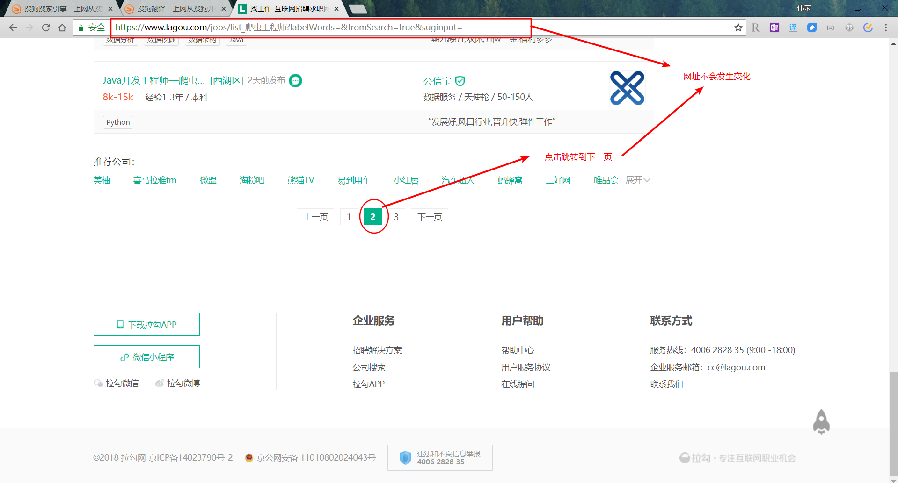

在 Chrome 浏览器左上角点击**安全**，再点击**禁止** JavaScript，**刷新**网页后发现职位信息全部被隐藏了，由此可见，职位信息是通过 异步 JavaScript 加载的。


大多数网页在浏览器中展示的内容都在HTML源代码中。但是，由于主流网站都使用 JavaScript 展现网页内容，和静态网页不同的是，在使用JavaScript时，很多内容并不会出现在HTML源代码中，所以爬取静态网页的技术可能无法正常使用。

### 1.1 异步加载：

AJAX（Asynchronous Javascript And XML，异步JavaScript和XML）。它的价值在于通过在后台与服务器进行少量数据交换就可以使网页实现异步更新。这意味着可以在不重新加载整个网页的情况下对网页的某部分进行更新。一方面减少了网页重复内容的下载，另一方面节省了流量，因此AJAX得到了广泛使用。 

传统的传输数据格式方面，使用的是 XML 语法，因此叫 AJAX ,现在在数据交互上更多的是使用 JSON。

### 1.2 动态抓取网页的方式

- 通过浏览器抓包分析
- 使用 selenium + Chromedriver 模拟浏览器抓取

| 方式           |       优点       | 缺点                                 |
| :------------- | :--------------: | :----------------------------------- |
| 浏览器抓包分析 | 代码量少，效率高 | 分析结构比较费劲，复杂网站加密，难爬 |
| 通过 selenium  |       稳定       | 代码量多，性能低                     |

## 2. 通过浏览器工具抓包分析真实网页地址

### 2.1任务描述

以爬取拉勾网职位信息列表及职位信息详情并保存为csv文件。如下图，在职位搜索框中输入`爬虫`，点击第一条爬虫工程师职位信息，将跳转到职位详情页面。

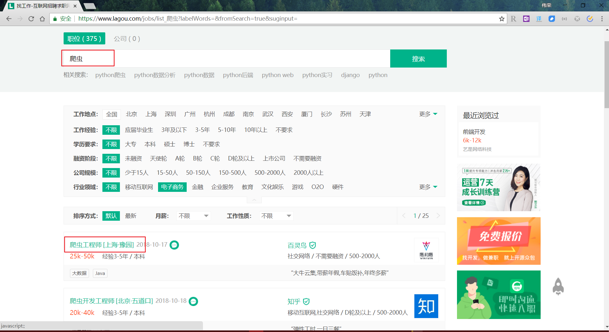

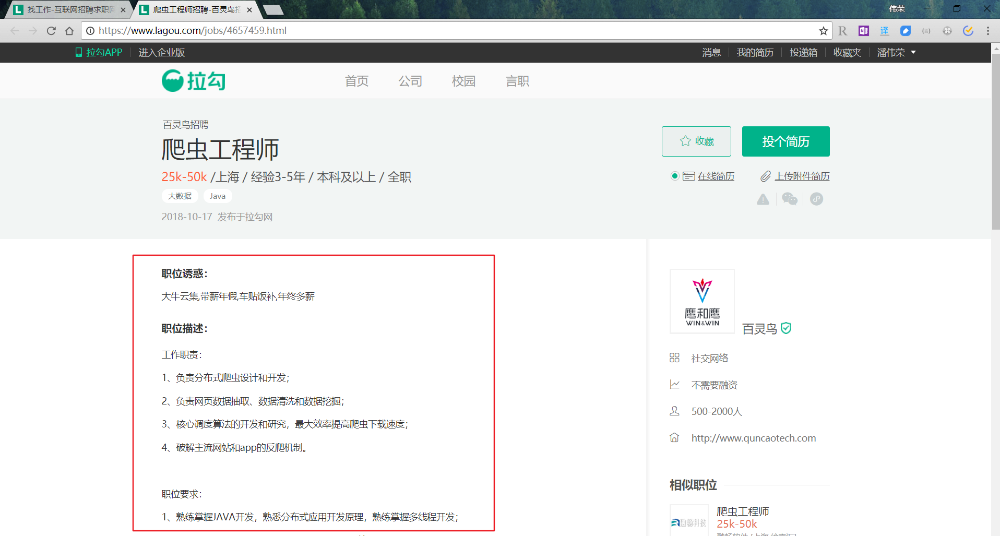

### 2.2  网页分析

在职位列表页右键点击查看网页源代码，Ctrl+F，输入第一条职位信息的公司”百灵鸟“，发现查找不到，说明该网页是采用AJAX技术异步加载的。

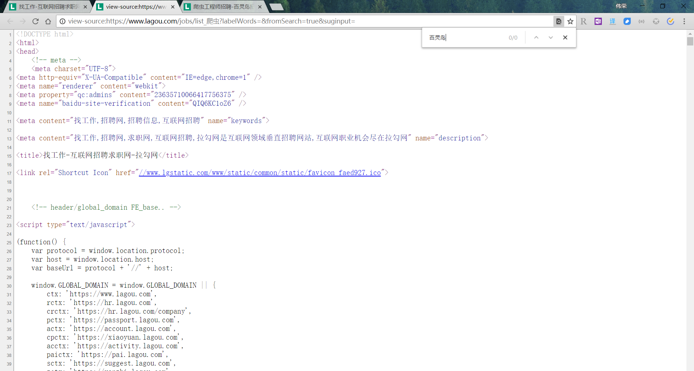

**寻找真正的数据源 url ：**

第一步： 鼠标右键点击`检查`：


第二步： 点击 `Network`,然后刷新网页


第三步： 点击`XHR`，再点击第一条内容

==注意：你会发现该网页的请求方式为 post==


第四步： 点击 Preview → content →positionResult → result


通过抓包分析，我们终于找到了要爬取的真实信息！

真实网络地址为：Request URL: 

https://www.lagou.com/jobs/positionAjax.json?city=%E6%9D%AD%E5%B7%9E&needAddtionalResult=false

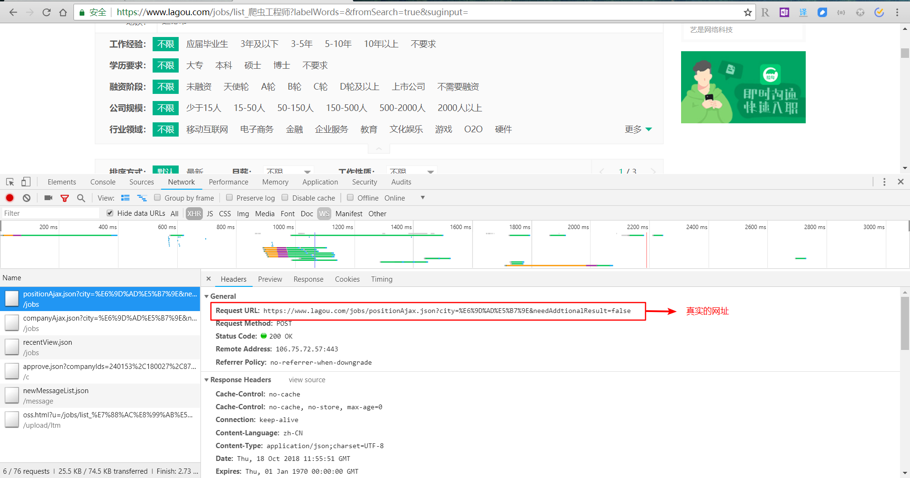

点击 Response 复制数据

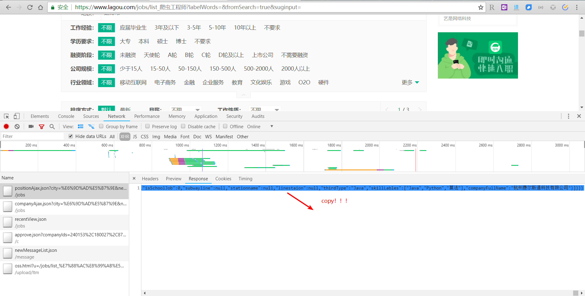

打开 https://www.json.cn/ 粘贴数据

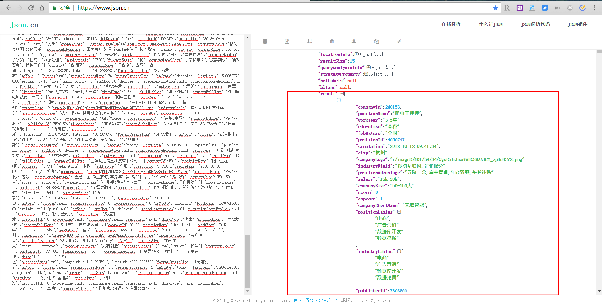

复制一条职位信息看看：

```js
               {
                    "companyId":61692,
                    "positionName":"爬虫工程师",
                    "workYear":"1-3年",
                    "education":"本科",
                    "jobNature":"全职",
                    "positionId":4013623,
                    "createTime":"2018-10-24 17:45:34",
                    "city":"北京",
                    "companyLogo":"i/image2/M00/13/C0/CgoB5lnwYE-AO1JdAABGvT5xkkE303.png",
                    "industryField":"游戏",
                    "positionAdvantage":"北大博士,腾讯大牛,电竞大数据,期权激励",
                    "salary":"18k-30k",
                    "companySize":"50-150人",
                    "score":0,
                    "approve":1,
                    "companyShortName":"Max+&小黑盒",
                    "positionLables":[
                        "游戏",
                        "Java",
                        "Python"
                    ],
                    "industryLables":[
                        "游戏",
                        "Java",
                        "Python"
                    ],
                    "publisherId":1546869,
                    "financeStage":"A轮",
                    "companyLabelList":[
                        "带薪年假",
                        "扁平管理",
                        "五险一金",
                        "弹性工作"
                    ],
                    "district":"朝阳区",
                    "businessZones":[
                        "望京",
                        "来广营",
                        "花家地"
                    ],
                    "longitude":"116.481255",
                    "latitude":"39.99671",
                    "formatCreateTime":"1天前发布",
                    "adWord":0,
                    "hitags":null,
                    "resumeProcessRate":100,
                    "resumeProcessDay":1,
                    "imState":"today",
                    "lastLogin":1540362505000,
                    "explain":null,
                    "plus":null,
                    "pcShow":0,
                    "appShow":0,
                    "deliver":0,
                    "gradeDescription":null,
                    "promotionScoreExplain":null,
                    "firstType":"开发|测试|运维类",
                    "secondType":"后端开发",
                    "isSchoolJob":0,
                    "subwayline":"15号线",
                    "stationname":"望京东",
                    "linestaion":"14号线东段_望京;14号线东段_阜通;14号线东段_望京南;15号线_望京东;15号线_望京",
                    "thirdType":"Java",
                    "skillLables":[
                        "Java",
                        "Python"
                    ],
                    "companyFullName":"清枫（北京）科技有限公司"
                },
```

第五步： 点击`Headers` 查看 `request` 加载方式


我们可以看到 `requests` 请求方式为 `post`  ,`request`请求需要设置 `data`：


```python
data = {'first':true,
		'pn':1,
        'kd:'爬虫工程师'}
# ’first' 判断是否为第一次请求
# 'pn' 网页页码
# 'kd' 请求的关键字
```

第六步： 爬取职位详情页职位描述信息

点击职位列表我们将跳转到该职位的详情页面，如图：

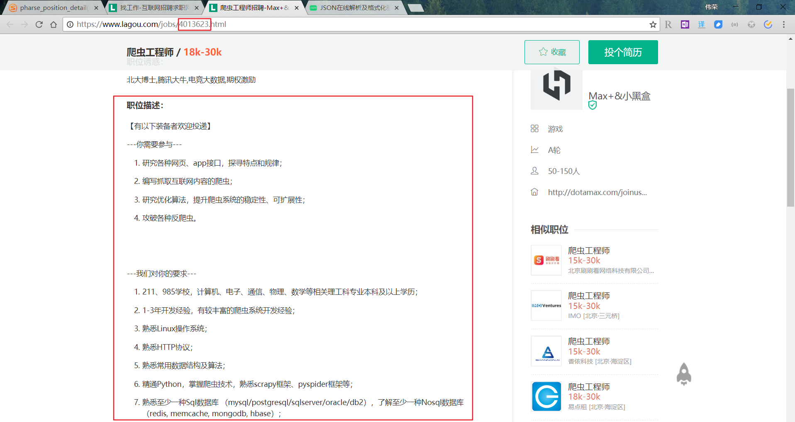

我们对网页进行分析，可以发现，该网页`URL`的规律为`https://www.lagou.com/jobs/positionId.html`，`4013623`为该职位的职位`ID`。

对网页请求方式进行分析，可以看到是通过`get`进行请求。

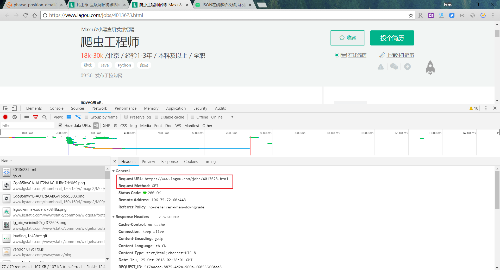


### ==2.2**实战代码：**==

以下代码实现了在[拉勾网](https://www.lagou.com)搜索特定职位，如`爬虫工程师`，爬取特定页数的职位列表信息及每一个职位的详细职位描述信息(通过职位ID进行url跳转)，并通过 pandas 存储为 csv 文件。

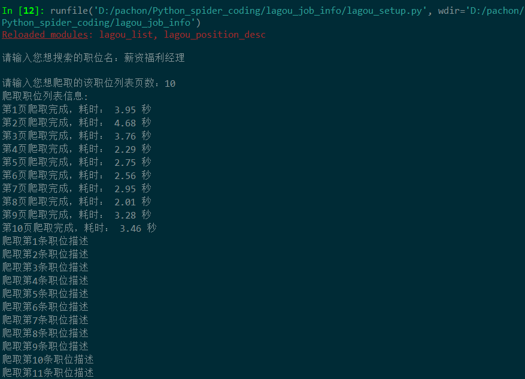

获取职位列表的代码`lagou_list.py`

```python
# -*- coding: utf-8 -*-
"""
Created on Wed Oct 24 23:04:54 2018
获取职位列表信息
@author: weiro
"""
import requests
import time
import random

headers = {'User-Agent':'Mozilla/5.0 (Windows NT 10.0; Win64; x64) AppleWebKit/537.36 (KHTML, like Gecko) Chrome/68.0.3440.106 Safari/537.36',
   'Referer':'https://www.lagou.com/jobs/list_%E7%88%AC%E8%99%AB%E5%B7%A5%E7%A8%8B%E5%B8%88?city=%E5%85%A8%E5%9B%BD&cl=false&fromSearch=true&labelWords=&suginput=',
   'Cookie':'_ga=GA1.2.1428374854.1539225510; user_trace_token=20181011103830-bd39c254-ccfe-11e8-af8c-525400f775ce; LGUID=20181011103830-bd39c733-ccfe-11e8-af8c-525400f775ce; showExpriedIndex=1; showExpriedCompanyHome=1; showExpriedMyPublish=1; hasDeliver=12; sensorsdata2015jssdkcross=%7B%22distinct_id%22%3A%2216660fd74218dc-0da56637c0f57-9393265-1327104-16660fd742238f%22%2C%22%24device_id%22%3A%2216660fd74218dc-0da56637c0f57-9393265-1327104-16660fd742238f%22%2C%22props%22%3A%7B%22%24latest_utm_source%22%3A%22m_cf_cpt_sogou_pc%22%7D%7D; LG_LOGIN_USER_ID=9217ae28983b65567f8f3d39072d76216ced598e80a20e0d; index_location_city=%E5%85%A8%E5%9B%BD; WEBTJ-ID=20181024223936-166a6843ce4ab-079d0dc8b6c80e-9393265-1327104-166a6843ce7155; _gid=GA1.2.531230428.1540391977; Hm_lvt_4233e74dff0ae5bd0a3d81c6ccf756e6=1539863439,1539925911,1539935074,1540391977; LGSID=20181024223936-a186047b-d79a-11e8-9e14-525400f775ce; PRE_UTM=m_cf_cpt_sogou_pc; PRE_HOST=www.sogou.com; PRE_SITE=https%3A%2F%2Fwww.sogou.com%2Fweb%3Fquery%3D%25E6%258B%2589%25E5%258B%25BE%26_asf%3Dwww.sogou.com%26_ast%3D%26w%3D01019900%26p%3D40040100%26ie%3Dutf8%26from%3Dindex-nologin%26s_from%3Dindex%26sut%3D3710%26sst0%3D1540391972914%26lkt%3D0%252C0%252C0%26sugsuv%3D1537265409903549%26sugtime%3D1540391972914; PRE_LAND=https%3A%2F%2Fwww.lagou.com%2Flp%2Fhtml%2Fcommon.html%3Futm_source%3Dm_cf_cpt_sogou_pc; _putrc=4628C166FF9F2E2C; JSESSIONID=ABAAABAAAGFABEF6F42EC4F7232601D3F22D61F711D21D9; login=true; unick=%E6%BD%98%E4%BC%9F%E8%8D%A3; gate_login_token=315b07fb028529bedd851924acfe04c4bee89144224f57c9; TG-TRACK-CODE=search_code; _gat=1; Hm_lpvt_4233e74dff0ae5bd0a3d81c6ccf756e6=1540393630; LGRID=20181024230710-7b2145a0-d79e-11e8-9e24-525400f775ce; SEARCH_ID=2c2154f9653147319d09a3590df9e16d',
   'X-Anit-Forge-Code':'0',
   'X-Anit-Forge-Token':'None',
   'X-Requested-With':'XMLHttpRequest'}

def get_list_page(data):
    """获取职位列表信息"""
    url = 'https://www.lagou.com/jobs/positionAjax.json?needAddtionalResult=false'
    # 翻页爬取
    print('爬取职位列表信息:')
    position_list = []
    for i in range(1,data['pn']+1):
        data['pn'] = i
        time_st = time.time() # 当前网页开始爬取的时间
        resp = requests.post(url,headers=headers,data=data)
        # 如果是json数据，那么这个方法将会自动load成字典
        result = resp.json()
        positions = result['content']['positionResult']['result']
        for position in positions:
            # 逐条职位字典载入到职位列表中
            position_list.append(position)
        
        # 设置时间等待 模拟正常浏览网页的状态
        time.sleep(random.randint(1,2)+random.random()) # 等待时间
        time_ed = time.time() # 当前网页完成爬取的时间
        print('第{}页爬取完成，耗时：'.format(i),round(time_ed-time_st,2),'秒')
    return(position_list)
    print('职位列表信息爬取完毕！')

    
def main():
    data = {'first':'false',
            'pn':2,
            'kd':'数据分析师'}
    position_list = get_list_page(data)
    # 打印展示
    i = 1
    for position in position_list:
        print(i)
        print(position['positionId'])
        i+=1
    
if __name__=='__main__':
    main()
```

获取职位描述的代码`lagou_position_desc.py`

```python
# -*- coding: utf-8 -*-
"""
Created on Thu Oct 25 14:16:02 2018
根据职位ID 获取职位详情页面职位描述信息
@author: weiro
"""
import requests
from lxml import etree
import time
import random
import lagou_list

headers = {'Cookie':'_ga=GA1.2.1428374854.1539225510; user_trace_token=20181011103830-bd39c254-ccfe-11e8-af8c-525400f775ce; LGUID=20181011103830-bd39c733-ccfe-11e8-af8c-525400f775ce; showExpriedIndex=1; showExpriedCompanyHome=1; showExpriedMyPublish=1; hasDeliver=12; sensorsdata2015jssdkcross=%7B%22distinct_id%22%3A%2216660fd74218dc-0da56637c0f57-9393265-1327104-16660fd742238f%22%2C%22%24device_id%22%3A%2216660fd74218dc-0da56637c0f57-9393265-1327104-16660fd742238f%22%2C%22props%22%3A%7B%22%24latest_utm_source%22%3A%22m_cf_cpt_sogou_pc%22%7D%7D; LG_LOGIN_USER_ID=9217ae28983b65567f8f3d39072d76216ced598e80a20e0d; index_location_city=%E5%85%A8%E5%9B%BD; _gid=GA1.2.531230428.1540391977; WEBTJ-ID=20181025140621-166a9d4b4715b-087ecc054c8e05-9393265-1327104-166a9d4b47c2d6; Hm_lvt_4233e74dff0ae5bd0a3d81c6ccf756e6=1540441053,1540441822,1540442226,1540447582; _putrc=4628C166FF9F2E2C; JSESSIONID=ABAAABAAAGGABCBDB9815C475C090778945AD68492A99C5; login=true; unick=%E6%BD%98%E4%BC%9F%E8%8D%A3; gate_login_token=4f7a119e3d67215865c0fa0a7e68f9847a03fce10d73cf5e; _gat=1; LGSID=20181025143827-94314229-d820-11e8-9eae-525400f775ce; PRE_UTM=; PRE_HOST=; PRE_SITE=https%3A%2F%2Fwww.lagou.com%2F; PRE_LAND=https%3A%2F%2Fwww.lagou.com%2Fjobs%2Flist_%25E9%25A3%258E%25E6%258E%25A7%25E5%25BB%25BA%25E6%25A8%25A1%3FlabelWords%3D%26fromSearch%3Dtrue%26suginput%3D; TG-TRACK-CODE=search_code; SEARCH_ID=a8d58b2012ab49ee84e515030dfcd3d2; Hm_lpvt_4233e74dff0ae5bd0a3d81c6ccf756e6=1540449875; LGRID=20181025144436-7067f3c1-d821-11e8-9eaf-525400f775ce',
           'User-Agent':'Mozilla/5.0 (Windows NT 10.0; Win64; x64) AppleWebKit/537.36 (KHTML, like Gecko) Chrome/68.0.3440.106 Safari/537.36'}

def get_positionDesc(position_list):
    """爬取职位详情页职位描述"""
    n = 1
    for position in position_list:
        print('爬取第%s条职位描述'%n)
        positionId = position["positionId"]
        position_desc_url = 'https://www.lagou.com/jobs/%s.html'%(positionId)
        response = requests.get(position_desc_url,headers=headers)
        html = response.text
        xml = etree.HTML(html)
        positionDESC = "".join(xml.xpath('//*[@id="job_detail"]/dd[2]/div/p/text()'))
        
        # 将职位描述信息加入到该职位字典中
        position["positionDESC"] = positionDESC.strip()
        time.sleep(random.randint(0,1)+random.random())
        n+=1
    return(position_list)


def main():
    data = {'first':'false',
            'pn':2,
            'kd':'文案策划'}
    position_list = lagou_list.get_list_page(data)
    position_list = get_positionDesc(position_list)
    # 打印展示
    i = 1
    for position in position_list:
        print(i)
        print(position)
        i+=1
    
if __name__=='__main__':
    main()
```

通过控制台输入想搜索的职位及要下载的职位列表数量,进行爬取并存储为csv与xlsx格式文件`lagou_setup.py`

```python
# -*- coding: utf-8 -*-
"""
Created on Thu Oct 25 14:18:31 2018
通过控制台输入想搜索的职位及要下载的职位列表数量
@author: weiro
"""
import pandas as pd
import lagou_list
import lagou_position_desc

def main():
    data = {'first':'false',
            'pn':2,
            'kd':'文案策划'}
    data['kd'] = input('请输入您想搜索的职位名：')
    data['pn'] = int(input('请输入您想爬取的该职位列表页数：'))
    position_list = lagou_list.get_list_page(data)
    position_list = lagou_position_desc.get_positionDesc(position_list)
    df = pd.DataFrame(position_list)
    df.to_csv('%s.csv'%(data['kd']),encoding='gb18030')
    df.to_excel('%s.xlsx'%(data['kd']))
    print('数据下载完毕！')
    
if __name__=='__main__':
    main()
```

最新代码可以从我的github中看到 [拉勾网职位列表信息与详情信息完美爬取-通过浏览器装包分析实现](https://github.com/weiropan/Python_spider_coding)

==容易被拉勾网反爬虫识别！！哎，干脆用`selenium`好了！==


## 3. 通过 selenium + Chromedriver 模拟浏览器抓取

在上面的例子中，通过浏览器抓包分析，找到了真是的 request 请求地址，但是也有一些网站比较复杂，很难找到调用的网页地址，甚至有些网站会进行加密处理。为此我继续学习使用浏览器渲染引擎，直接用浏览器在显示网页时解析HTML、应用 CSS 样式并执行 JavaScript 的语句。

这个方法在爬虫过程中会打开一个浏览器加载该网页，自动操纵浏览器浏览各个网页，顺便把数据抓取下来。即使用浏览器渲染方法将爬取动态网页变成爬取静态网页。

### 3.1 selenium + Chromedriver 的介绍与安装

#### 3.1.1 什么是selenium ？

- selenium 是一个用于 web 应用程序测试的工具。 selenium 测试直接运行在浏览器中，浏览器自动按照脚本代码做出单击、输入、打开、验证等操作，就像真正的用户在操作一样。
- Chromedriver 是一个 *驱动 Chrome 浏览器* 的驱动程序，使用它才能驱动浏览器。

#### 3.1.2 安装 selenium 4步走：

##### 第一步 安装：

和其他 python 库一样通过 cmd 中 pip 安装

```python 
pip install selenium
```

##### 第二步 下载：

下载[Chromedriver](http://npm.taobao.org/mirrors/chromedriver/2.33/)，解压后放在环境变量的 path 中，在 Windows 系统中可以将其下载后放在 Anaconda 的安装地址中，如 C:\Users\weiro\Anaconda3\Scripts 为我的安装地址。

##### 第三步 设置环境变量：

- 如图打开系统属性页面

  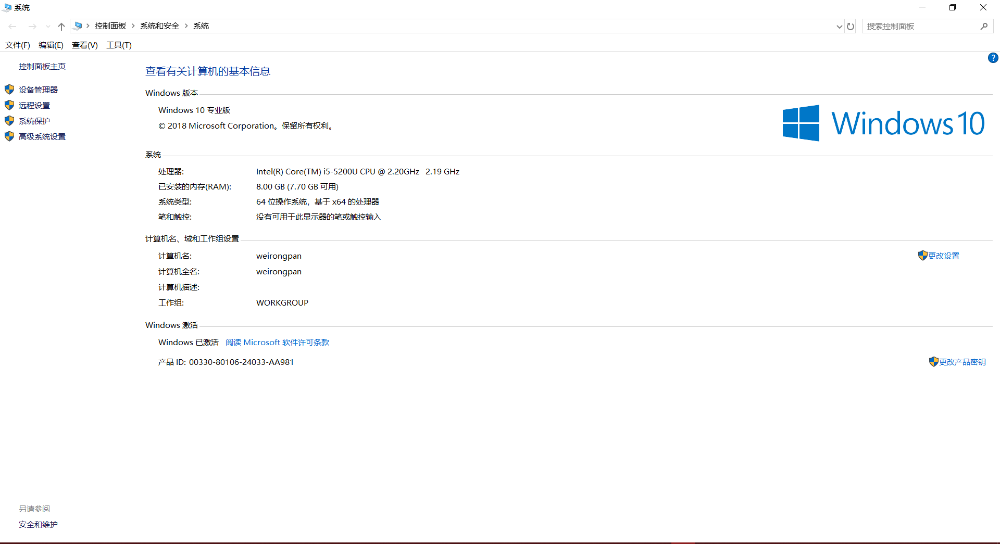

- 点击高级系统设置

  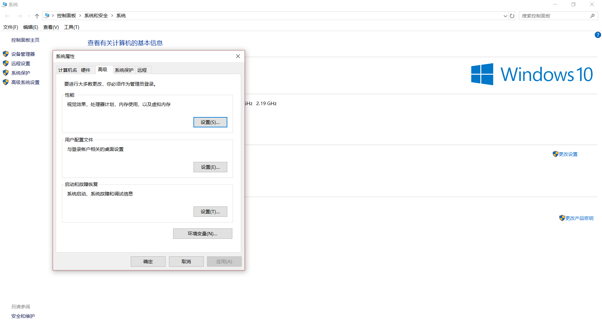

- 点击环境变量,选中 path , 点击编辑

  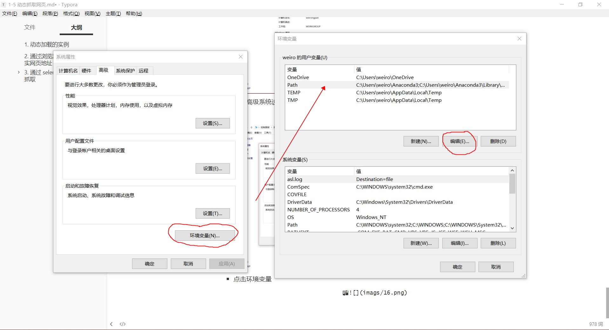

- 在编辑环境变量页面，点击新建，复制 Anaconda 的安装地址,点击确定。如下图，我已经将目录 copy 到 环境变量的 path 中。

  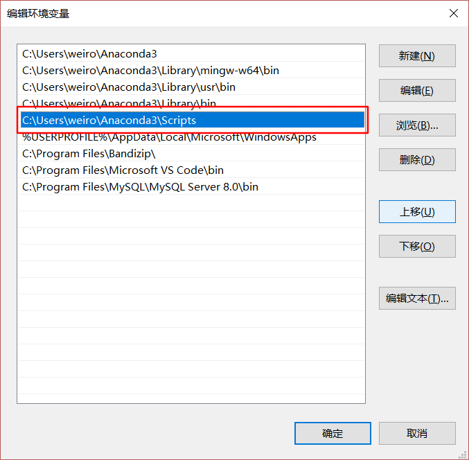

##### 第四步:使用代码进行测试

```python
from selenium import webdriver       # 导入包
driver = webdriver.Chrome()          # 打开 Chrome 浏览器
driver.get('https://www.sogou.com/') # 打开搜狗搜索引擎首页
print(driver.page_source)            # 获取网页源代码
```

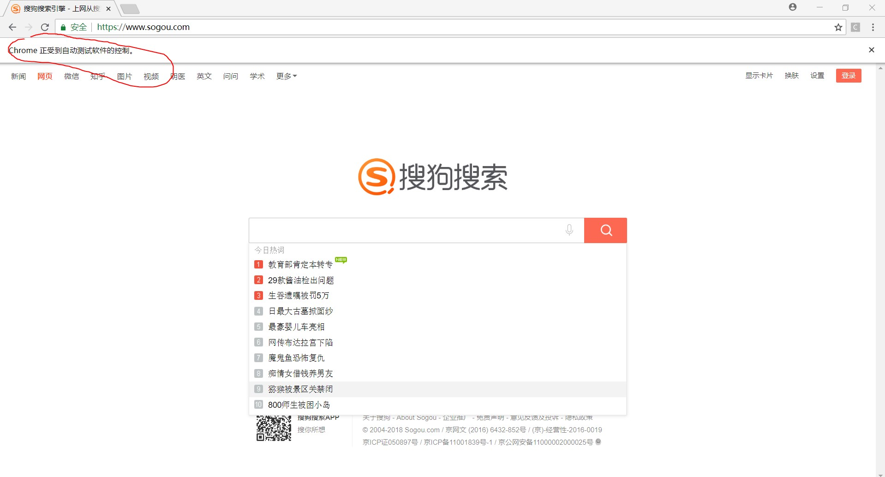

### ==3.2 selenium 常用操作==

#### 3.2.1 关闭页面：

- driver.close()  关闭当前页面；

- driver.quit()  退出整个浏览器。

  ```python
  from selenium import webdriver       # 导入包
  import time
  driver = webdriver.Chrome()          # 打开 Chrome 浏览器
  driver.get('https://www.baidu.com/') # 打开百度搜索引擎首页
  time.sleep(10)
  driver.close() # 关闭当前网页
  time.sleep(5)
  driver.quit() # 退出整个浏览器
  ```


#### 3.2.2 定位元素 

以搜狗搜索主页 https://www.sogou.com/ 为例，要使用 selenium 自动打开 Chrome 浏览器 并在输入框中输入 `爬虫`，并搜索。

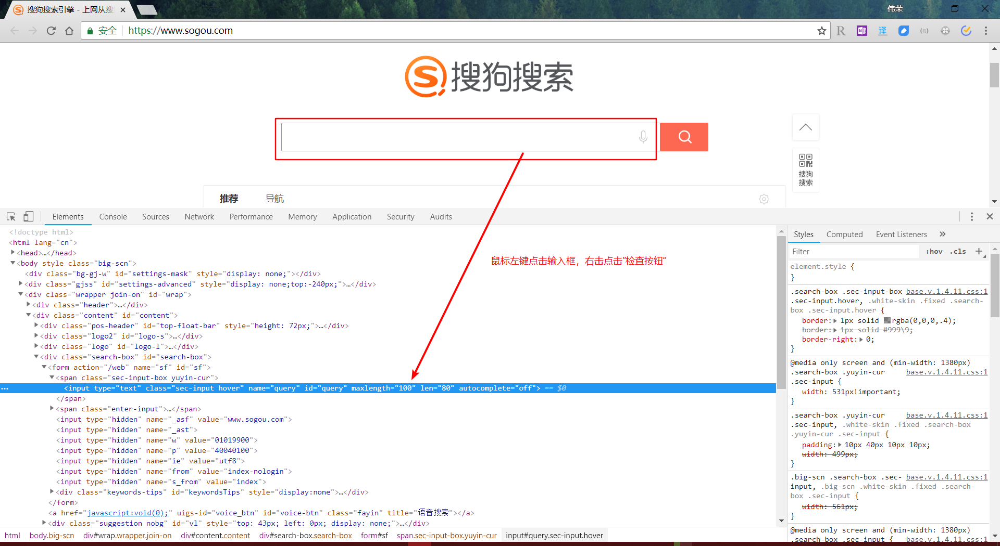

##### ① find_element_by_id 根据 id 来查找某个元素。

```python 
# 导入包
from selenium import webdriver
# 初始化 driver
driver = webdriver.Chrome()
url = 'https://www.sogou.com/'
# 打开 url
driver.get(url)
# 根据 id 查找某个元素
inputTag = driver.find_element_by_id('query')
"""
# 等价写法
from selenium.webdriver.common.by import By
inputTag = driver.find_element(By.ID,'query')
"""
# 搜索 “爬虫”
inputTag.send_keys('爬虫')
submitTag = driver.find_element(By.ID,'su')
```

##### ② find_element_by_class_name 根据类名来查找元素

```python
# 导入包
from selenium import webdriver
# 初始化 driver
driver = webdriver.Chrome()
url = 'https://www.sogou.com/'
# 打开 url
driver.get(url)
# 根据 类名 查找某个元素
inputTag = driver.find_element_by_class_name('sec-input')
# 搜索 “爬虫”
inputTag.send_keys('爬虫')
```

##### ③ find_element_by_name 根据 name 属性的值来查找元素

```python
# 导入包
from selenium import webdriver
# 初始化 driver
driver = webdriver.Chrome()
url = 'https://www.baidu.com/'
# 打开 url
driver.get(url)
# 根据 name 属性值查找某个元素
inputTag = driver.find_element_by_name('wd')
# 搜索 “爬虫”
inputTag.send_keys('爬虫')
```

##### ④ find_element_by_tag_name 根据标签名来查找元素

```python
# 导入包
from selenium import webdriver
# 初始化 driver
driver = webdriver.Chrome()
# 打开url
driver.get(url)
# 根据标签名来查找元素
driver.find_element_by_tag_name('div')
```

##### ⑤ find_element_by_xpath 根据 xpath 语法来获取元素

```python
# 导入包
from selenium import webdriver
# 初始化 driver
driver = webdriver.Chrome()
url = 'https://www.baidu.com/'
# 打开 url
driver.get(url)
# 根据 xpath 值查找某个元素
inputTag = driver.find_element_by_xpath('//*[@id="kw"]')
# 搜索 “爬虫”
inputTag.send_keys('爬虫')
```

##### ⑥ find_element_by_css_selector 根据 css 选择器选择元素

```python
# 导入包
from selenium import webdriver
# 初始化 driver
driver = webdriver.Chrome()
url = 'https://www.baidu.com/'
# 打开 url
driver.get(url)
# 根据 css 选择器 查找某个元素
inputTag = driver.find_element_by_css_selector('#kw')
# 搜索 “爬虫”
inputTag.send_keys('爬虫')
```

##### ==注意==

1. `find_element`是获取第一个满足条件的元素,`find_element**s**`是获取所有满足条件的元素

2.  如果只想要解析网页中的数据，那么推荐奖网页源代码 `driver.page_source` 扔给 `lxml`解析，因为 `lxml`底层使用的是 c 语言，所以解析效率会更高。

   尝试爬取拉勾网`数据分析师`岗位信息中的`公司名`。

   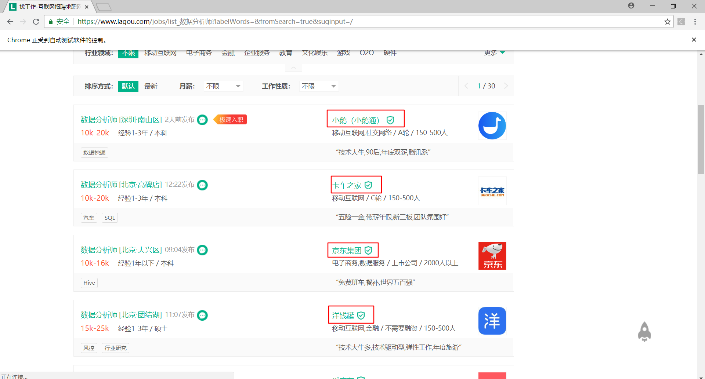

```python
# 爬取拉勾网数据分析师岗位信息中的公司名

# 导入包
from selenium import webdriver
from lxml import etree
# 初始化 driver
driver = webdriver.Chrome()
url = 'https://www.lagou.com/jobs/list_%E6%95%B0%E6%8D%AE%E5%88%86%E6%9E%90%E5%B8%88?labelWords=&fromSearch=true&suginput=/'
# 打开 url
driver.get(url)
html = driver.page_source
print(html)

xml = etree.HTML(html)
company_names = xml.xpath('//*[@id="s_position_list"]/ul/li/div[1]/div[2]/div[1]/a/text()')
i=1
for company_name in company_names:
    print(i)
    print(company_name)
    i+=1
```

3.  如果想要对元素进行一些操作，比如给一个文本框输入值，或者是点击某个按钮，那么就必须使用 `selenium`提供给我们的查找元素的方法 `driver.find_element_by_……`

#### 3.2.3 操作表单元素

##### ① 操作输入框：

分为两步。第一步，找到这个元素。第二步：使用 `send_keys(value)`,将数据填充进去。如百度的搜索框。


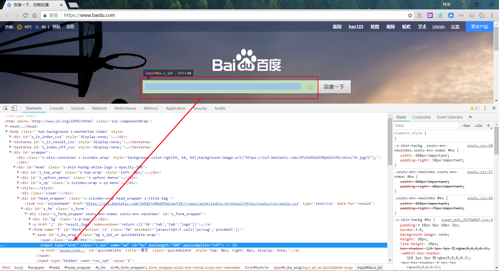

```python
inputTag = driver.find_element_by_id('kw')
inputTag.send_keys('数据分析师')
```

使用`.clear()`方法可以清楚输入框中的内容

```python
# 导入包
from selenium import webdriver
import time
# 初始化 driver
driver = webdriver.Chrome()
url = 'https://www.baidu.com/'
# 打开 url
driver.get(url)
# 定位
inputTag = driver.find_element_by_id('kw')
# 输入
inputTag.send_keys('学习Python')
# 持续时间
time.sleep(6)
# 清空
inputTag.clear()
```

##### ② 操作 checkbox： 

因为要选中`checkbox`标签，在网页中是通过鼠标点击的，因此想要选中 `checkbox`标签，应先定位到该标签，再执行`click`事件。

`type="checkbox"`

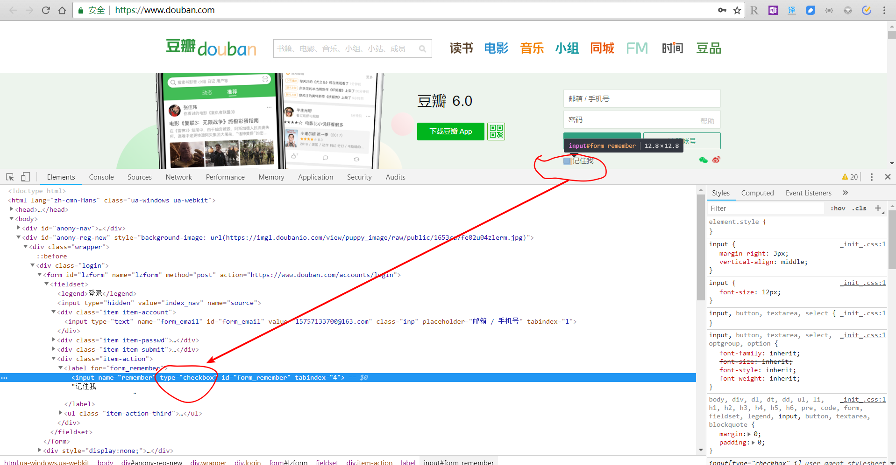

```python
# 导入包
from selenium import webdriver
import time
# 初始化 driver
driver = webdriver.Chrome()
url = 'https://www.douban.com/'
# 打开 url
driver.get(url)
# 定位
remember_btn = driver.find_element_by_id('form_remember')
# 勾选
remember_btn.click()
# 持续时间
time.sleep(6)
# 取消勾选
remember_btn.click() 
```

##### ③ 选择 select：

**下拉列表** select 元素不能直接点击，因为点击后还需要选中元素。因此 selenium 专门为 select 标签提供了一个类： `selenium.webdriver.support.ui.Select`。将获得的元素当成参数传到这个类中，创建这个对象，然后就可以使用这个对象进行选择了。[潍坊公积金网站](http://www.wfgjj.gov.cn/)就存在这种元素。

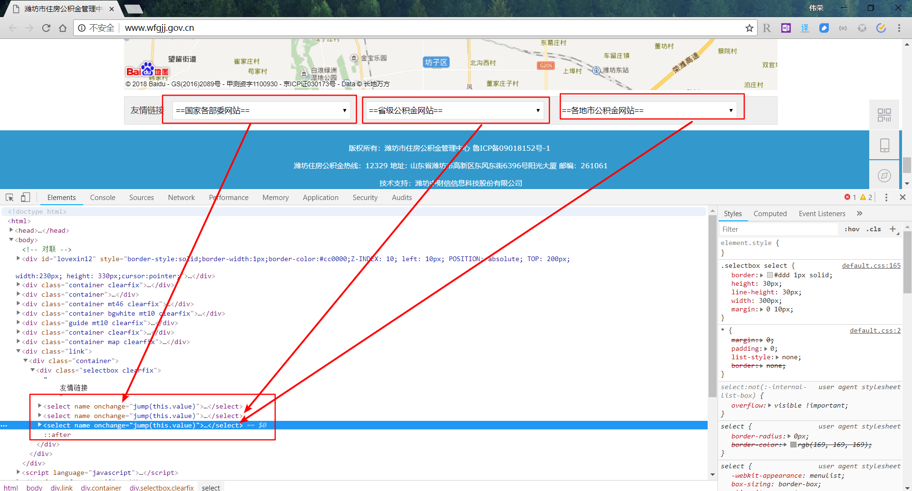

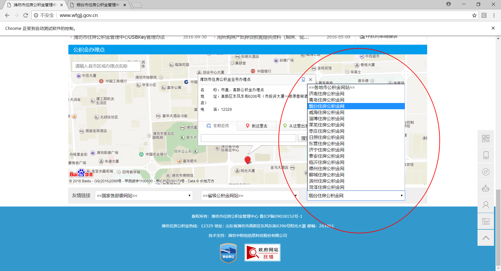

示例代码：

```python
# 导入包
from selenium import webdriver
from selenium.webdriver.support.ui import Select
import time
# 初始化 driver
driver = webdriver.Chrome()
url = 'http://www.wfgjj.gov.cn/'
# 打开 url
driver.get(url)
# 选中这个标签然后使用 Select 创建对象
selectTag = Select(driver.find_element_by_xpath('/html/body/div[9]/div/div/select[3]'))
# 根据可视文本选择 访问 烟台住房公积金网
selectTag.select_by_visible_text('烟台住房公积金网')
time.sleep(5)
# 根据索引选择 访问 威海住房公积金网
selectTag.select_by_index(4)
time.sleep(5)
# 根据值选择 访问 青岛住房公积金网
selectTag.select_by_value('http://www.qdgjj.com/')
# 取消选中所有项
selectTag.deselect_all()
```

##### ④ 操作按钮：

操作按钮有很多种方式。如单击、右击、双击等。

鼠标左键单击直接调用`click`函数就可以了。

```python
# 导入包
from selenium import webdriver
import time
# 初始化driver
driver = webdriver.Chrome()
# 打开网页
driver.get('https://www.sogou.com/')
# 定位搜索框
inputTag = driver.find_element_by_id('query')
# 输入要查询的内容
inputTag.send_keys('今日天气')
# 定位搜索按钮
clickBtn = driver.find_element_by_id('stb')
# 等待
time.sleep(3)
# 点击搜索
clickBtn.click()
```

#### 3.2.4 行为链

有时候在页面中操作，可能需要很多步，那么这时候可以使用鼠标行为链类`ActionChains`l来完成。比如现在要将鼠标移动到某个元素上并执行点击事件。

```python
# 导入包
from selenium import webdriver
from selenium.webdriver.common.action_chains import ActionChains

# 初始化 Chrome
driver = webdriver.Chrome()
driver.get('https://www.sogou.com/')

# 定位元素
inputTag = driver.find_element_by_class_name('sec-input')
stbTag = driver.find_element_by_id('stb')

# 行为链
actions = ActionChains(driver)
actions.move_to_element(inputTag)
actions.send_keys_to_element(inputTag,'心理学')

actions.move_to_element(stbTag)
actions.click(stbTag)

actions.perform()
```

==还有更多的鼠标相关操作：==

- click_and_hold(element) 点击但不松开鼠标
- context_click(element) 右键点击
- doubl_click(element)  双击

#### 3.2.5 Cookie 操作

##### ① 获取所有的 cookie

```python
# 导入包
from selenium import webdriver
# 初始化chrome
driver = webdriver.Chrome()
driver.get('https://www.sogou.com/')
# 获取全部的 cookies
cookies = driver.get_cookies()
print(cookies)
print(type(cookies))

# 逐条打印 cookie
i = 1
for cookie in cookies:
    print(i)
    print(cookie)
    print(type(cookie))
    i+=1
```

##### ② 根据cookie 的 key 获取 value

```python
from selenium import webdriver

driver = webdriver.Chrome()
driver.get('https://www.sogou.com/')

for cookie in driver.get_cookies():
    print(cookie)

print('**'*18)
print(driver.get_cookie('osV'))
```

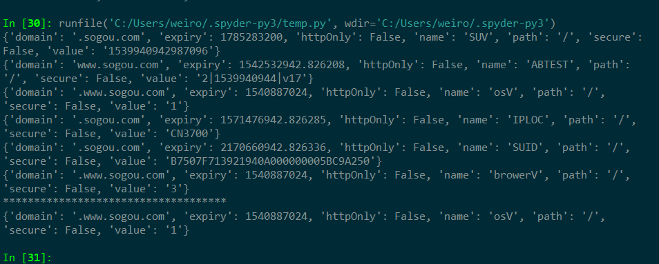

##### ③ 删除某个 cookie

```python
from selenium import webdriver

driver = webdriver.Chrome()
driver.get('https://www.sogou.com/')
# 获取所有的 cookie
for cookie in driver.get_cookies():
    print(cookie)
# 根据cookie 的 key 获取 value
print('**'*28)
print(driver.get_cookie('osV'))
print('**'*28)
# 删除某一特定的cookie
driver.delete_cookie('osV')
print(driver.get_cookie('osV'))
```

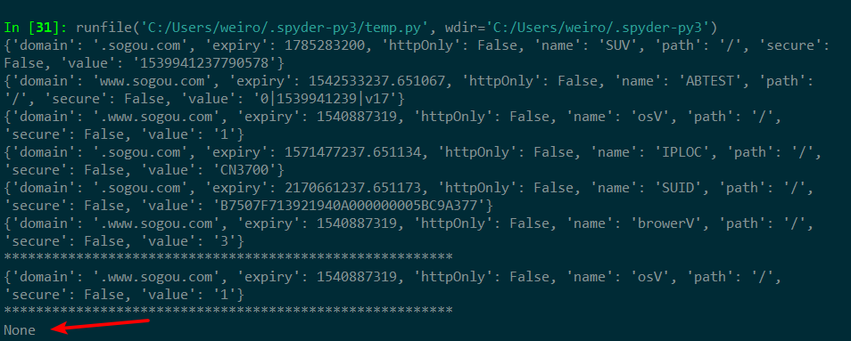

##### ④ 根据`cookie`的`key`删除所有的`cookie`

```python
# 删除所有的cookie
driver.delete_all_cookies()
```

#### 3.2.6 页面等待

由于目前越来越多的网页采用了`AJAX`技术，导致程序很难判断何时所有元素加载完成，若实际等待时间过长导致某个dom元素还没出来，但是你的代码直接使用了这个`WebElement`，则程序会抛出`NullPointer`的异常。

`selenium`为了解决这个问题，提供两种等待方式，隐式等待与显式等待。

```python
# 导入包
from selenium import webdriver
# 初始化Chrome
driver = webdriver.Chrome()
driver.get('https://www.douban.com/')
'''
任意输入一串字符作为元素id去查找
不舍等待将直接报错
'''
driver.find_element_by_id('form_remember-sd;')
```

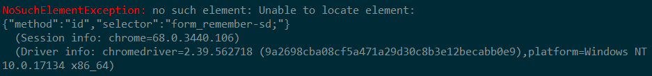

##### ① 隐式等待 ：

调用`driver.implictitly_wait`,在获取元素之前将等待10秒钟，10秒后不管元素是否真实存在或加载成功，程序将自动进行查找。

```python
# 导入包
from selenium import webdriver
# 初始化Chrome
driver = webdriver.Chrome()
driver.get('https://www.douban.com/')
# 设置隐式等待时长15s
driver.implicitly_wait(10)
driver.find_element_by_id('form_remember-sd;')
```

##### ② 显式等待 ：

显式等待是若满足设定的条件则元素==立刻获取==，若没获取到元素则设置一个最长等待时间，若超出这个时间则抛出一个异常。显示等待调用`selenium.webdriver.support.excepted_conditions`期望的条件与`selenium.webdriver.support.ui.WebDriverWait`来配合完成。

```python
# 导入包
from selenium import webdriver
from selenium.webdriver.support.ui import WebDriverWait
from selenium.webdriver.support import expected_conditions as EC
from selenium.webdriver.common.by import By

# 初始化Chrome
driver = webdriver.Chrome()
driver.get('https://www.douban.com/')

# 设置显式等待时长10S
WebDriverWait(driver,10).until(
        EC.presence_of_element_located((By.ID,'ghjkl;')) 
        )
```

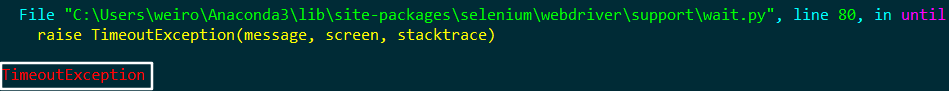

##### ③ 一些其他的等待条件 ：

- presence_of_element_located: 某个元素已经加载完毕了
- presence_of_all_element_located: 网页中所满足条件的元素已经加载完毕了
- element_to_be_cliable:某个元素是可以点击了

#### 3.2.7 切换页面

有时候窗口中有很多的子 tab 页面，此时肯定需要进行切换，`selenium`提供了一个叫做`switch_to_window`来进行切换，具体切换到哪一个页面，可以从`driver.window_handles`中找到。

```python
# 打开一个新的页面
self.driver.execute_script("window.open('url')")
# 切换到一个新的页面
self.driver.switch_to_window(self.driver.window_handles[1])
```

- 打开一个新页面

  ```python
  # 导入包
  from selenium import webdriver
  
  # 初始化 Chrome
  driver = webdriver.Chrome()
  driver.get('https://www.baidu.com/')
  # 打开一个新页面
  driver.execute_script("window.open('https://www.douban.com/')")
  
  # 打印当前driver对应的url地址 仍为 https://www.baidu.com/
  print(driver.current_url)
  ```

  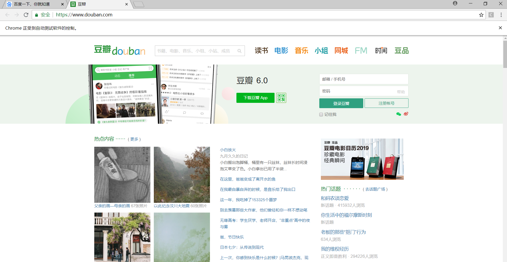

- 切换 `driver`到新的页面

  ```python
  # 导入包
  from selenium import webdriver
  # 初始化 Chrome
  driver = webdriver.Chrome()
  # 打开网页
  driver.get('https://www.taobao.com/')
  # 打开新的页面
  driver.execute_script("window.open('https://www.baidu.com/')")
  # 检查当前dirver对应的url
  print(driver.current_url)
  # 打印url句柄列表
  print(driver.window_handles)
  # driver切换到新的页面中
  driver.switch_to_window(driver.window_handles[1]) # 会按照打开的顺序进行排序
  # 检查当前driver页面
  print(driver.current_url)
  
  # 虽然在窗口中切换到了新的页面，但是 driver 中并没有切换，
  # 若想要在代码中也切换到新的页面，并且做一些爬虫，
  # 则应该使用 driver.switch_to_window 来切换到指定的窗口，
  # 从 driver.window_handles 中取出具体第几个窗口，
  # driver.window_handles 是一个列表，里面装的都是窗口句柄，
  # 它会按照打开页面的顺序来存储窗口的句柄。
  ```

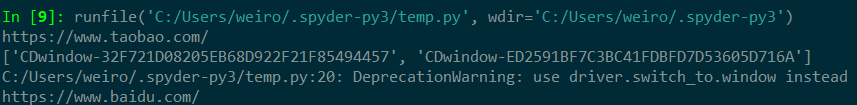

#### 3.2.8 设置代理 ip ：

有时候，频繁爬取某些页面也会被识别为爬虫。

```python
from selenium import webdriver

driver_path = r'C:\Users\weiro\Anaconda3\Scripts\chromedriver.exe'
chrome_options = webdriver.ChromeOptions() # 用于设置Chrome浏览器的选项信息
# chromeOptions.add_argument('--proxy-server= http://proxy:port')
chrome_options.add_argument("--proxy-server=http://119.190.193.59:8060")

driver = webdriver.Chrome(executable_path=driver_path,chrome_options=chrome_options)
driver.get('http://httpbin.org/ip')
# 与系统IP地址不同
```

- 常见的免费开放IP
  - [快代理](https://www.kuaidaili.com/ops/)
  - [西刺免费代理IP](http://www.xicidaili.com/)
- [Python爬取西刺国内高匿代理ip并验证](https://blog.csdn.net/Oscer2016/article/details/75000148)

#### 3.2.9 `WebElement`元素

`from selenium.webdriver.remote.webelement import WebElement`类是每个获取出来的元素的所属类。

有一些常用的属性：

- get_attribute: 这个标签的某个属性的值
- screentshot: 获取当前页面的截图，这个方法只能在`driver`上使用。`driver`的对象类，也是继承自 `WebElement`

### ==3.3 实战代码==


 


